# **Project Overview**

[Quiz it](https://aleksandratr.github.io/quiz-it/) is a web application designed to assess and ensure compliance with Construction Design Management Regulations 2015.  

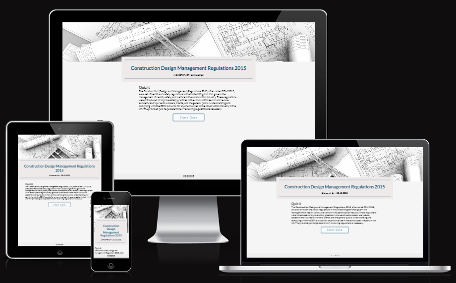
 
 
## **Table of contents**
* [Project overview](#Project-Overview)
* [Table of contents](#table-of-contents)
* [Project Planning](#project-planning)
* [Website colour palette](#website-colour-palette)
* [Typography](#typography)
* [Main features](#main-features)
* [Home Page](#home-page)
* [Quiz window](#quiz-window)
* [Testing Phase](#testing-phase)
* [Bugs Section](#bugs-section)
* [Deployment](#deployment)
* [Technology](#technology)
* [Credits](#credits)

## **Project Planning**

### **Target Audiences**

This app is intended for construction professionals, project managers, architects, engineers, and anyone involved in the construction industry, aiming to streamline the process of ensuring safety, quality, and compliance with construction regulations.

### **Website business goals**

- Bring the attention of construction professionals to the website to increase the website traffic.
- Research potential advertising opportunities and collaborations with other businesses. 
- Market the Quiz It brand, with a specific focus on the construction industry.

### **Business owner user stories**

As the business owner of Quiz It, I want to attract construction industry professionals. The tool should allow visitors to test CDM regulations understanding and advice if further material revision is required. The website should allow me to:
- Simple layout that is easy to read and simple to navigate when working on various devices, including mobiles, tablets, and desktops.
- Create a web application that has a simple layout.
- Design intuitve navigation.
-  Implement an interactive web application incorporating graphics of usable resolution, legible, unobscured text, consistent styling, and undistracted foregrounds.

### **Business owner content requirements**
- Incorporate an image that reflects the construction industry.
- Provide a high-level subject introduction and objective of the Quiz.
- Provide multiple-choice questions with instant feedback. 
- Provide questions that examine CDM 2015 understanding.
- Provide differenFeedt levels 
- Provide feedback on the test results.

### **Website User Story**
As a Quiz It web application user, I want to take a self-assessment on CDM regulations to help me review the subject and ensure my understanding is up-to-date. The web application shall allow me the following:
- Access a visually appealing simple layout homepage.
- Intuitive navigation and simple interaction.  
- Feedback on the answers.
- Feedback on the test results.
- Choice of examination levels.
- Keep the history of the test.
- Option to email the test result and date of the test taken.

### **Requirements revision**
The initial product must have a basic quiz functionality that allows for adding, editing, and removing quiz questions and answers without requiring a complete quiz redesign. The Quiz should work smoothly on different-sized device screens, with a minimum screen size of 320px by 568px. It is crucial that the text and all functional interface elements remain unobstructed.

### **The minimally viable product**
- Home page
- Quiz functionality

Additional pages were added to provide feedback to the user. These pages are:
- 404 Page Cannot Be Found error message page

### **Suggested future improvements**
- Choice of examination levels.
- Keep the history of the test.
- Option to email the test result and date of the test taken.

### **Wireframes**
High level web app design - 

Home page - 
 
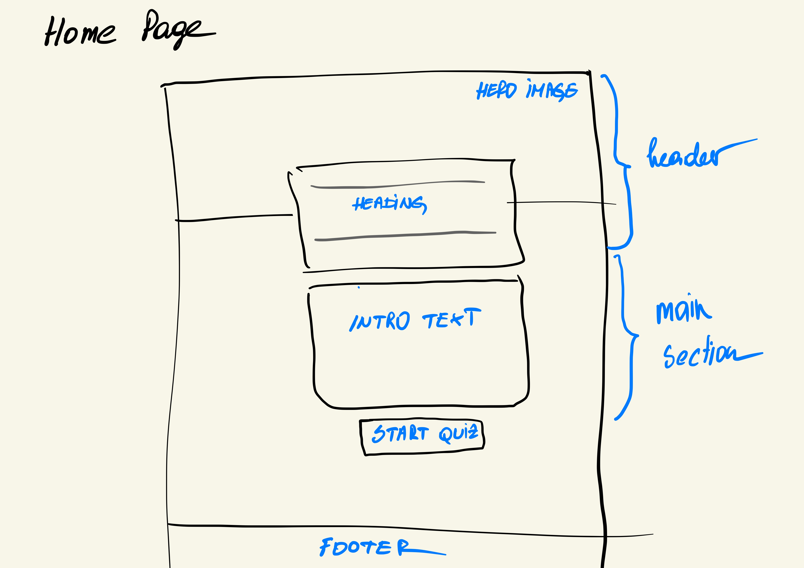 
 

Quiz window - 
 
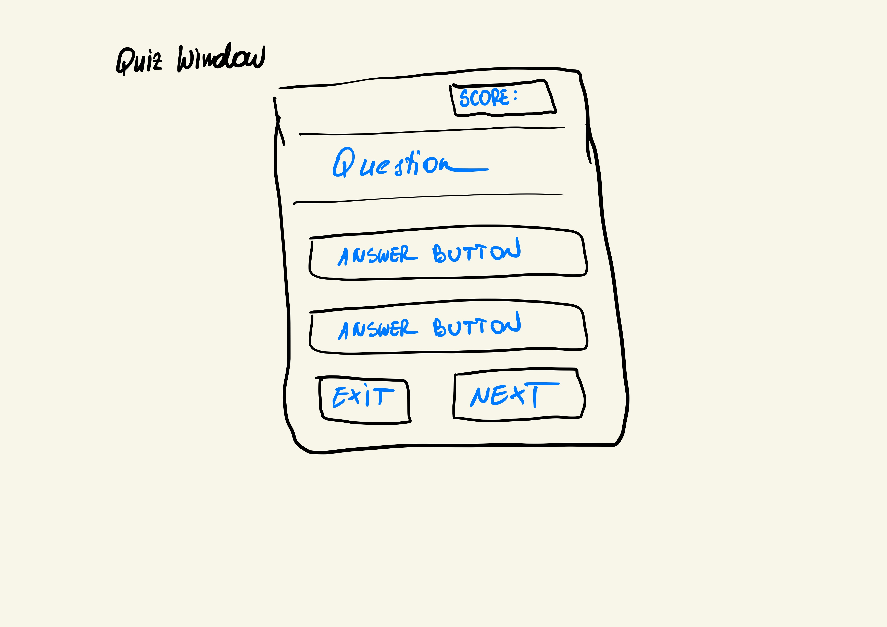 
 

Feedback window - 
 
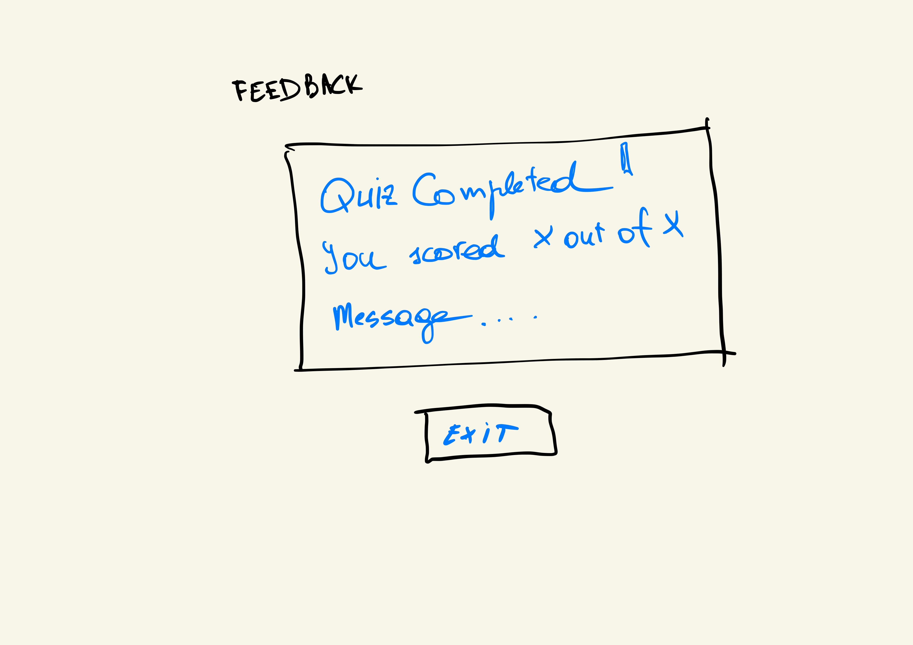 
 

### Final version redesign
The final quiz window look has changed from the original wireframe sketch. The decision was made to move the exit button to the top of the quiz window to avoid accidental button clicks during the test. 

## **Website colour palette**
Construction drawings inspire the home page colour scheme and feature shades of grey and black. The colour scheme of the homepage, inspired by construction drawings and featuring shades of grey and black, likely conveys a professional, industrial, and modern aesthetic. The use of grey and black colours is familiar in design themes related to construction, architecture, and engineering for several reasons: Professionalism, Neutrality, and Modern Aesthetics, among others. 

The home page also incorporates a shade of Prussian-blue accent to add visual interest, guide users' attention and connect with the quiz page, where a deep blue is the primary colour. Considering colour connections, blue represents the sky and the sea and is associated with open spaces, freedom, intuition, imagination, and inspiration. These colour associations are deemed relevant for the primary Quiz page colour. 

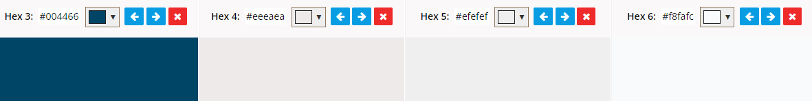

### **Typography**
For the website design, several fonts are used:
All links and buttons are set to "Roboto", part of the sons-serif family. The font was chosen following research on the most readable font family for buttons and labels.
All other text uses Lato Google font, a part of the sans-serif family that provides a clean, modern look.

## **Main Features** 
The website has a Home page and a separate quiz window invoked from the home screen located button 'Start Quiz". The layout of the home page includes:
- A hero-image section,
- A website's central section,
- A footer with copy-right text and date.

The design is responsive, providing usability on different screen size devices.

### **Home page**
The home page consists of the following:
- A hero-image section,
- A website's central section,
- Footer.

Hero section features:
- Hero image hints users about the nature of the business.
- The heading provides the subject's name.
- Additional information includes the author's name and the webpage material publish date.

Desktop view -   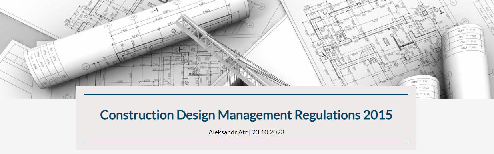
Mobile device view -  

A website's central section:
- Provides additional information about the subject and informs about the quiz objective.
- Provides a button that invokes quiz.

Desktop view -   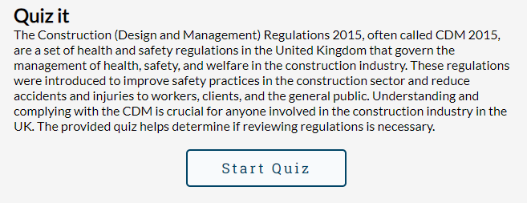
Mobile device view -   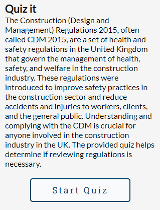

 The footer is at the bottom of the screen and is designed to display copyright information. It also serves as a placeholder for additional information in future updates.

The footer features:
- Copyright information

Desktop view -   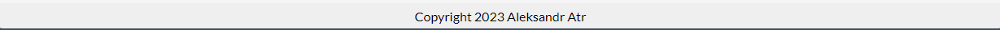
Mobile device view -  
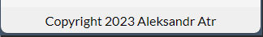

### **Quiz window**
The Quiz window displays the Quiz question multiple choice answers, a window with current score and a total question number.

The Quiz window consists of the following:
- Exit Quiz button,
- Score/Number of questions window,
- Question placeholder,
- Multiple-choice answer buttons,
- Next button.

The Quiz window features:
- The Exit Quiz button allows exit Quiz without relying on the Go Back browser button.
- Score/Number of questions window shows the number of total questions against correctly answered questions.
- The question placeholder shows the sequence question number and the current question.
- Answer buttons show multiple-choice answers. After selecting the answer, the following actions will take place: 
    - The Answer button will change its colour. The colour will be green if the selected answer is correct or red if the answer is incorrect. A correct answer will also be highlighted if a wrong answer is chosen. This feature provides instant question feedback.
    - The score will go up by one if the correct answer is selected. The score will remain the same if the incorrect answer has been chosen.
    - The Next button will appear.
- The Next button allows you to move to the next question if there are still questions in the list. If all questions are answered, the Next button will take you to the result page, where test result feedback will be provided.

Desktop view Quiz window -   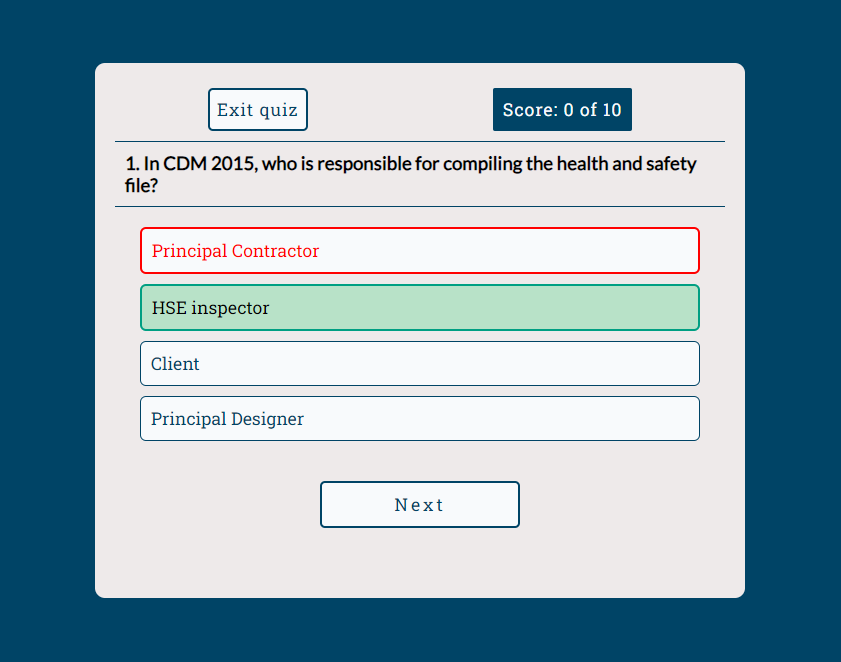

Desktop view Quiz feedback -   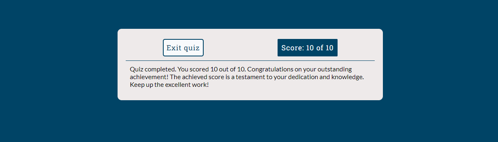

Mobile view Quiz window -   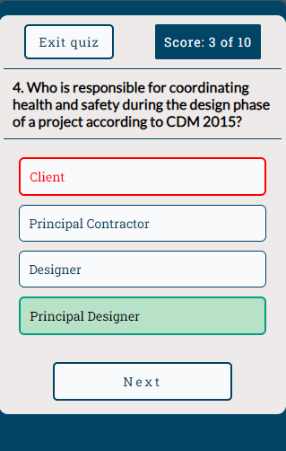

Mobile view Quiz feedback  -   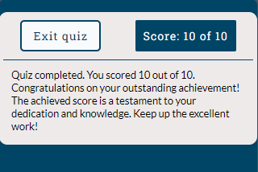
 
## **Testing Phase**

In front-end development, automated and manual testing ensures that a website or web application works correctly, performs well, and provides a positive user experience.
### Automated testing 
- Automated testing involves using software tools and scripts to perform tests.
- Test scripts are written to simulate user interactions, validate functionality, and detect issues automatically.
- Automation is highly repeatable and consistent, making it ideal for regression testing.
It provides detailed test reports and can be integrated into Continuous Integration/Continuous Deployment (CI/CD) pipelines.
### Manual testing
- Manual testing involves human testers executing test cases and evaluating the application.
- Testers explore the application, identify usability issues, and perform ad-hoc testing.
It allows testers to use their intuition and creativity to find unanticipated issues.

In practice, many projects use a combination of automated and manual testing. Automated testing is ideal for repetitive and well-defined scenarios, while manual testing is better for exploring unanticipated issues, evaluating usability, and providing a human perspective on quality.

Manual testing is to be undertaken to check the functionality of the web application. The test covers the following areas - 
- Responsiveness
- Browser compatibility
- Lighthouse
- Code Validation
- User Stories
- Features

### **Responsiveness**
The web application has been designed and built to be responsive to cater to various screen-size devices. The test procedures are as follows:
1. Open project in DevTools
1. Check responsiveness for three screen sizes:
    * Desktop (1300px wide screen)
    * Mobile device (320px wide screen)
1. For each screen size, undertake the following checks:
    *   Check text is clearly displayed
    *   Check images layout
    *   Check if the rendering is as per the design
    *   Report the results

#### **Responsiveness test results**
Tests were undertaken in the Chrome browser (by Google) using in-built developer tools. The date of the test is 22/10/2023.

Results summary: 
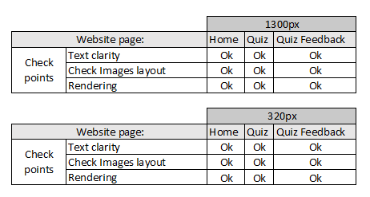

#### Home page 
Desktop (1300px wide screen)  
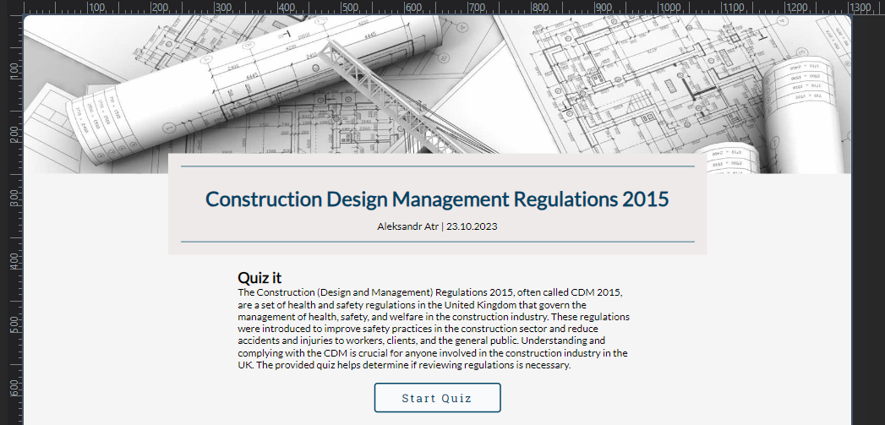

Mobile device (320px wide screen)  
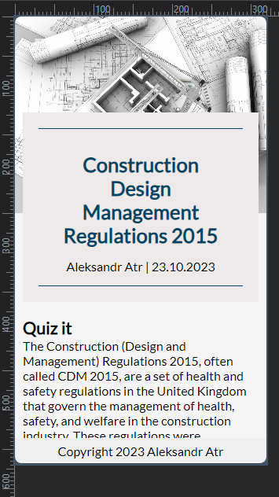

#### Quiz window 
Desktop (1300px wide screen)  

Mobile device (320px wide screen)  
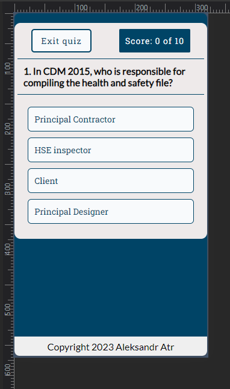

#### Feedback window 
Desktop (1300px wide screen)  
  
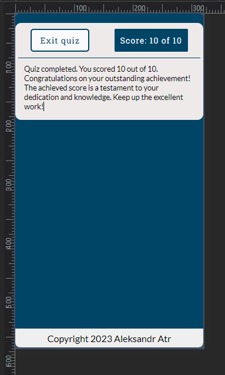

## **Browser compatibility test results - Manual testing**
The website has been tried on various browsers to check its functionality. The following browsers have been used:
- Safari.
- Chrome.
- Edge.

The manual testing is split into the following categories - 

## Webpage appearance
1. The text displayed is clear, and the Start Quiz Button is on the page.

### Quiz Start Button test.
1. Check the button changes the background colour on hover over.
1. Check that the button opens the quiz window on the click.

## Quiz window check
Check the appearance of the quiz window and displayed text. The window shall display - 
- Exit Button, 
- Score window, 
- Number of questions (ten in the questions list),
- The current question number, 
- The current questions,
- Multiple choice answers (four in each question),
- The next button - appears when the answer is selected.

### Exit Button check
1. Check the button changes the background colour on hover over.
1. Check the Exit button that should take the user to the web application's home page with a mouse click.

### Score window
1. Check that the score is 0 when none of the answers were selected
2. Check that the score increases by one after a correct answer is selected.
3. Check that the score remains the same after a new question is displayed.
4. Check that the score remains the same after an incorrect answer is selected.
5. Select five correct answers and five incorrect ones. Check that the total score equals five.
6. Select all correct answers and check that the total score equals the number of questions.

### Number of questions check
1. Check that the number of questions in the score window equals the total number in the questions list of the questions.js file (Type = module). It shall be ten number.

### The current question check
1. Check the current question format: a question number followed by a dot and a question.
1. Check that the current question number increases by one when a new question is displayed.
1. Check that the text content changes every time a new question is displayed.
1. Check that the final question number equals the questions in the Score window.

### Multiple-choice answer buttons check
1. Check that four answers are displayed each time a new question is displayed.
1. Check that the answer button background colour is changed with a mouse hover. Check all answer buttons.
1. Check all buttons disabled after answer selection.

### Select the incorrect answer to check if:
1. Check selected wrong answer text and border colour changed to red.
1. Check the answer chosen background colour changed to green.

### Select the correct answer to check if:
1. Check the selected answer background and border colour changed to green.

### The next Button check
1. Check that the Next button is not displayed until an answer is selected.
1. After clicking the Next Button, check that the new questions and answers are revealed.
1. Check that the Next button is not displayed when a new question is displayed (and the answer is not selected).

## The feedback window check
The window check shall display the following:
- The Exit button,
- The score window with the achieved score against the total number of questions,
- The feedback.

### Exit Button check
1. Check the Exit button that should take the user to the web application's home page with a mouse click.

### The score window check
1. Check that the score is the same as the feedback text.
1. Check that the score is the same as the last answered question score

### Check feedback messages. 
1. If the score is >=90%, the feedback shall be: 
"Quiz completed. You scored X out of 10. Congratulations on your outstanding achievement! The achieved score is a testament to your dedication and knowledge. Keep up the excellent work!" where X is the number of correct answers.

### Check feedback messages. 
1. If the score is between >=70% and <90%, the feedback shall be: 
"Quiz completed. You scored X out of 10. Congratulations on completing the quiz! You're doing great, and your effort is commendable. To improve even further, consider reviewing the material in the near future." where X is the number of correct answers.

### Check feedback messages. 
1. If the score is <70%, the feedback shall be: 
"Quiz completed. You scored X out of 10. Great job on completing the quiz! It's the first step to excelling yourself. As you scored less than 70%, you should revisit the material as soon as possible to reinforce your regulations understanding. Keep up the good work!" where X is the number of correct answers.

The date of the test is 22/10/2023. All test results successfull. No errors or comments.
 
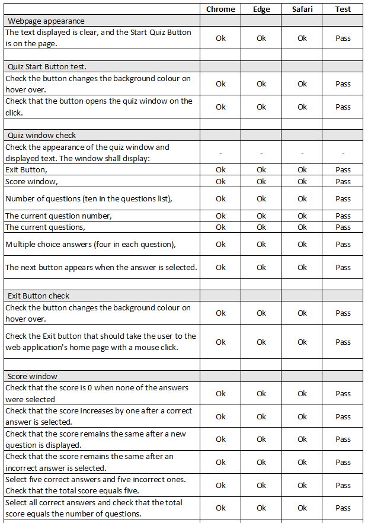
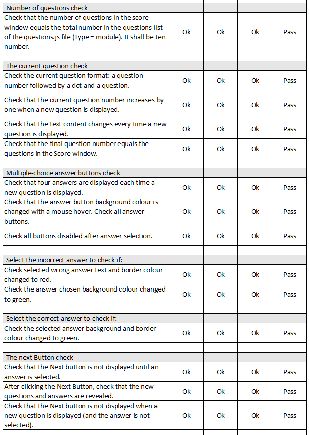
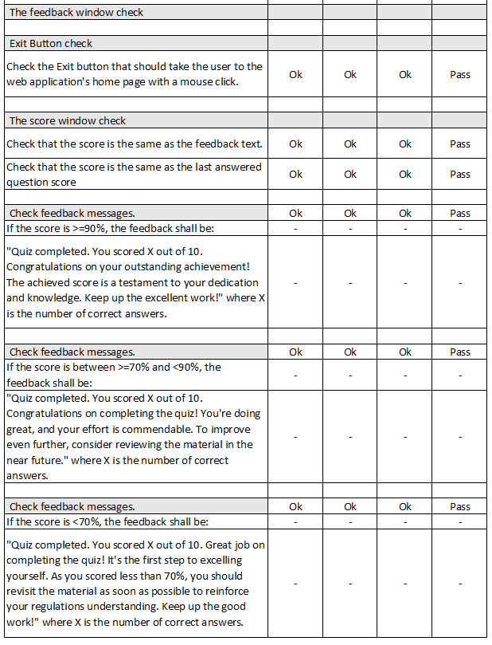

#### **Bugs section**
During the website development, numerous bugs were found and fixed. These were:
- Incorrect class names in HTML and CSS files were fixed by copying/pasting the names to the required places.
- Accidentally deleted semicolons in CSS property values were fixed by adding them back.
- Accidentally deleted curly braces in the main.js file were fixed by adding them back.
- Incorrect attribute tags and values were fixed by correcting them.
- The control flow of the completed main.js file was checked in the Chrome DevOp tool using the debugger keyword. The code was then stepped over, and it was found the following: 
1. Some functions have been executed but were not supposed by the design. It was hard to determine as it would not affect the final output result. It would affect the performance but negligibly due to the scale of the program. However, it could have led to other errors if the quiz needed to be scaled. The bug was fixed by redesigning the quiz logic.
2. The other issue was found with the quiz logic/readability. The initial design looped through all answers to find the correct answer if incorrect was selected. If the first answer were right, the loop would continue to go through the rest of the answers in the list. The design has been changed from a loop to a select query function that would find the correct answer based on the attribute. It was deemed a minor technical issue, as the result would be the same in both cases. However, the design has been changed to the later option as it was deemed better for code readability. 

#### **Lighthouse test**
Lighthouse is an automated tool for improving web page quality, including performance, accessibility, and SEO audits. It's a feature that is built into the DevOps tool. Each website page is tested using the lighthouse tool. 

The test procedures are as follows:
- Open a webpage in a Chrome browser.
- In the developer tool, select Lighthouse.
- Select the following categories:
    - Performance
    - Progressive Web App
    - Best Practices
    - Accessibility
    - SEO
- Run tests for devices:
    - Mobile
    - Desktop

 
The date of the test is 22/10/2023. The results are as follows:
  

Desktop (1300px wide screen)  
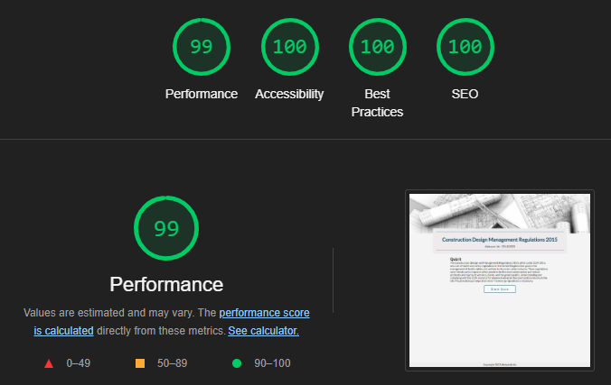

Mobile device (320px wide screen)  
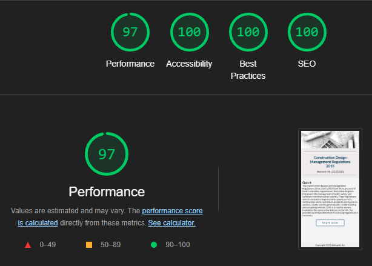

#### **HTML validator test**
The website has been checked in W3C HTML Validator. It is a free online tool to verify HTML document syntax and compliance with W3C specifications and standards. 

The test procedures are as follows:
- Open W3C HTML Validator.
- Load required HTML file.
- Undertake check.
- Repeat for all pages.
- Report the results.

The date of the test is 22/10/2023. The results are as follows: 

 

 

#### **CSS validator test**
The website has been checked using CSS validation service, which verifies web developers' CSS code against W3C specifications, ensuring consistent and correct application across different browsers and devices and ensuring valid syntax and standards.

The test procedures are as follows:
- Open jigsaw CSS Validator.
- Load the required CSS file.
- Undertake check.
- Report the results

The date of the test is 22/10/2023. The results are as follows:  

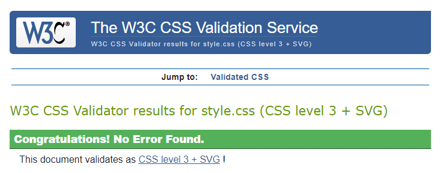
 

#### **JSHint validator**
The website has been checked using JavaScript validator service, highlighting suspicious usage in JavaScript programs.

The test procedures are as follows:
- Open JSHint validator.
- Load the required JavaScript file.
- Undertake check.
- Report the results

The date of the test is 22/10/2023 - no errors have been found  

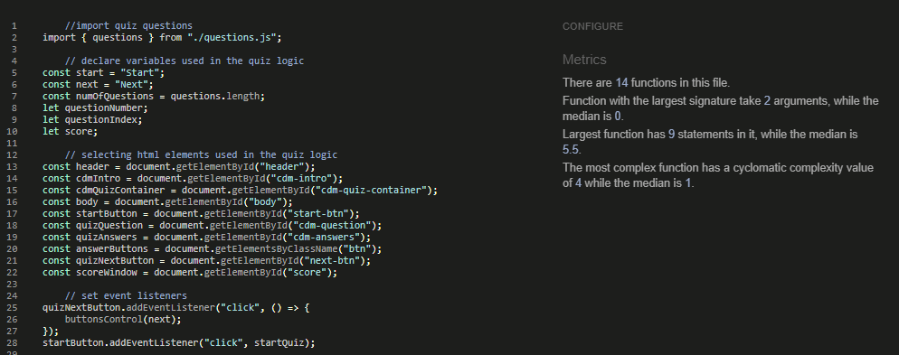
 

#### **Features test**
All the features were tested as part of the responsive and web browser compatibility tests - no issues to report.

#### **Business owner and User stories tests**
The website has been checked against business and user stories. The results are as follows: 
 
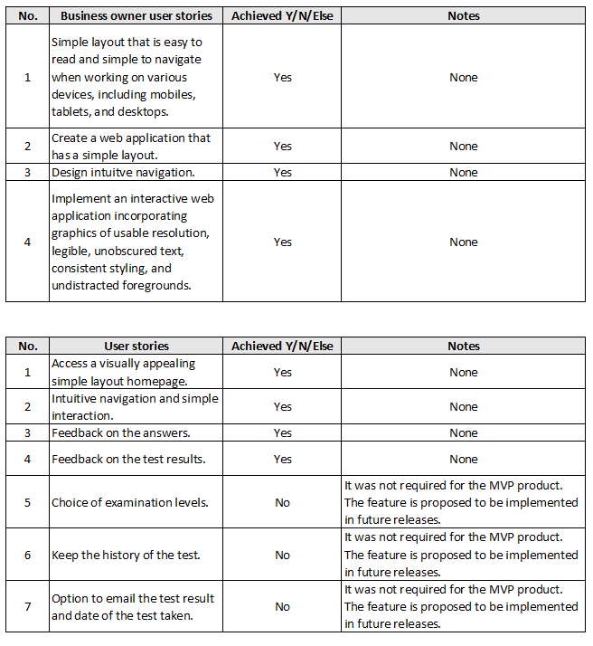
 

## **Deployment**
The website is deployed on GitHub following the below steps:
- Go to my GitHub repository's "Settings" tab.
- Scroll down to the "GitHub Pages" section.
- Under "Source," choose the branch (e.g., "main") from which to deploy my website.
- Click "Save" to enable GitHub Pages for my repository.

GitHub Pages will now build and deploy the website. Once the process is complete, a link to the live website will be in my repository settings' "GitHub Pages" section.

## **Technology**
The website has been built using the following tech:
- HTML5
- CSS3
- JavaScript
- Google Fonts
- Fontawesome

The following tools have been used during the development:
- VS Code
- Git
- GitHub
- Code Institute Project Template
- Microsoft Excel
- Windows 10 Enterprise
- Chrome, Safari, Edge browsers
- Microsoft Snipping tool
- Tinypng website
- Coolors website
- Goodnotes app
 
## **Credits**
Website resources:  
- Photos - photos were downloaded from Shutter Stock - https://www.shutterstock.com/
- Favicon - was downloaded from the favicon website - https://favicon.io/
- Fonts - some fonts were downloaded from Google Fonts - https://fonts.google.com/
- JavaScript - Hamburger Navigation bar menu inspiration and code was taken from - https://www.youtube.com/watch?v=mh36Kts-wX8

Website development:  
During the project development, references were made to various online learning resources to get inspiration for the design and problems solving.  

- The HTML and CSS basics learn from the Code Institute education portal - https://learn.codeinstitute.net/dashboard
- Items alignment in elements - https://www.w3.org/Style/Examples/007/center.en.html
http://jsfiddle.net/a3nyexqg/
- Understanding of the problems encountered during development was taken from the StackOverflow website. One of the problems encountered during the development was that the event listener did not overwrite the button functionality after defining it in the line below the original definition. I found in StackOverflow that the event listener cannot be overwritten but needs to be removed using the remove and add methods to redefine the new event listener to the same button. - https://stackoverflow.com/questions/50370156/overriding-the-event-listener-in-javascript
- Some inspiration comes from the quiz app development video found on YouTube- https://www.youtube.com/watch?v=PBcqGxrr9g8&t=1808s

Personal appreciation:

Thank you, Code Institute team, for your invaluable help and support throughout the course. Your efforts are greatly appreciated.

I'm thankful to my mentor, Aleksei Konovalov, for his invaluable guidance and support. Thank you, Aleksei!

I'm grateful to my wife, Margarita, for her support and feedback on the web application visuals.

